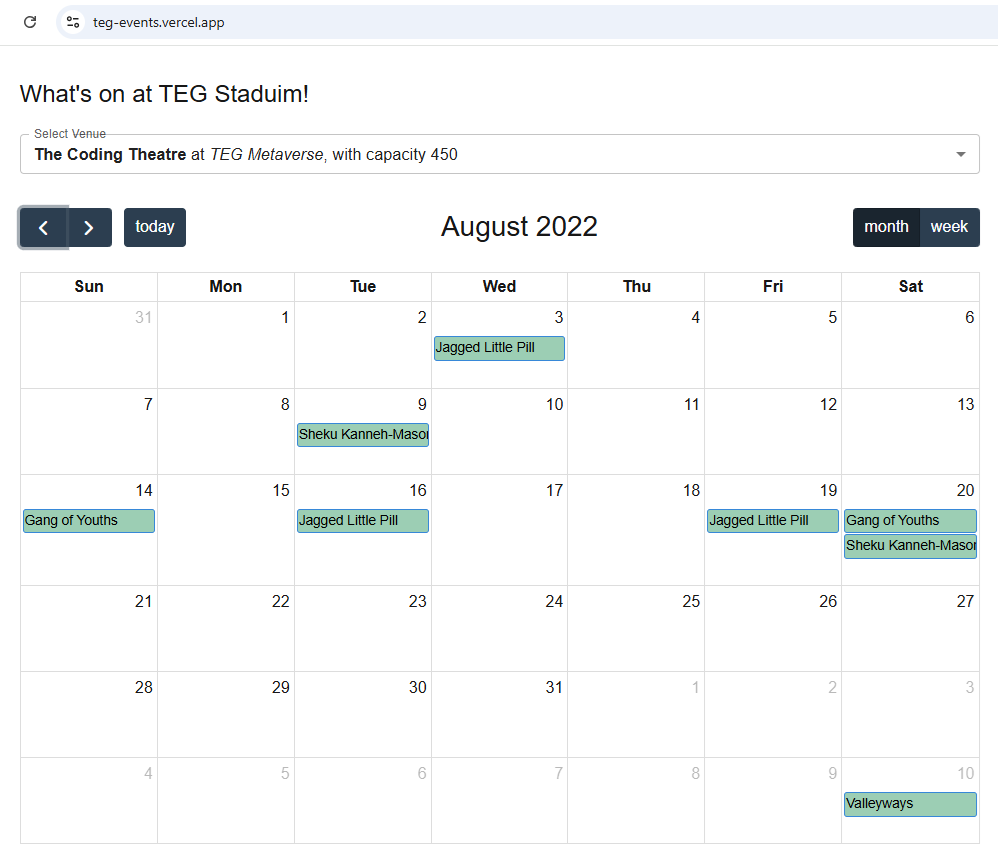
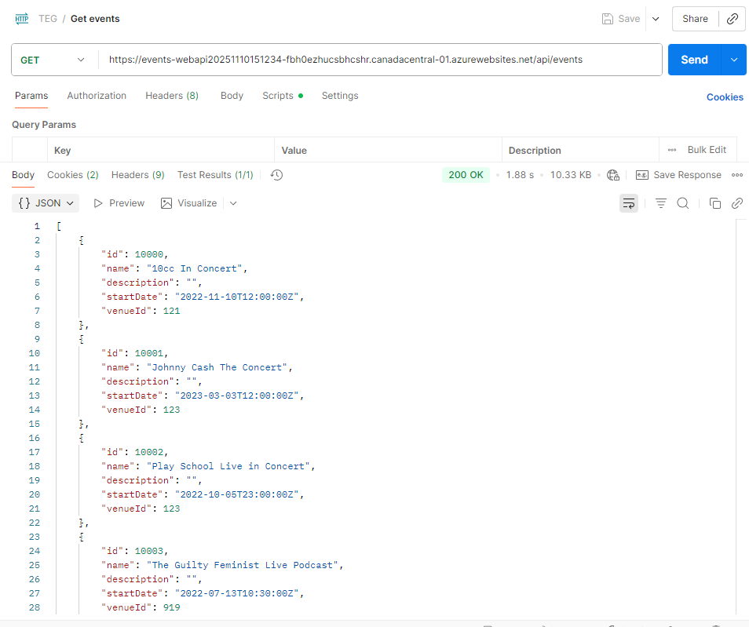

# TEGEvents

TEG challenge by Greg Luo (greg.luo@outlook.com)

## Front-end UI

Implemented using Next.js 16, React 19, Redux, FullCalendar, MUI, Jest.

### Deployed on Vercel

https://teg-events.vercel.app/

### setup UI instructions

- install dependencies: npm i
- run UI: npm run dev
- run test cases: num run test

## Back-end Web API

implemented using .NET 9 and C# 13, Entity Framework, and xUnit etc.

### Deployed on Azure

- https://events-webapi20251110151234-fbh0ezhucsbhcshr.canadacentral-01.azurewebsites.net/api/events
- https://events-webapi20251110151234-fbh0ezhucsbhcshr.canadacentral-01.azurewebsites.net/api/events/venues
  

### setup API instructions

- restores all NuGet packages: dotnet restore
- build the project: dotnet build
- run the project: dotnet run

  or

- open the solution in Visual Studio 2022
- hit F5 to run and debug
- right click the "Events-WebAPI-Tests" project and select "Run Tests" to run unit test cases
